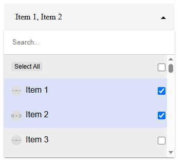

# AngularSelect2

This project was generated using [Angular CLI](https://github.com/angular/angular-cli) version 20.0.2.

## Development server

To start a local development server, run:

```bash
ng serve
```

Once the server is running, open your browser and navigate to `http://localhost:4200/`. The application will automatically reload whenever you modify any of the source files.

## Get started

Download `shared/custom-select` component and import your project



```
html
<app-custom-select 
      formControlName="multi" 
      [options]="myOptions" 
      (onSelectItem)="handleMulti($event)"
      [config]="{
        multiple: true,
        maxVisibleItems: 100,
        selectAllButton: true,
        searchable: true
      }" 
      placeholder="Select Item">
    </app-custom-select>
```

```
ts
myOptions = largeData;
selectedItemObjects: any[] = [];

handleMulti(items: any[]) {
   this.selectedItemObjects = items;
}
```
